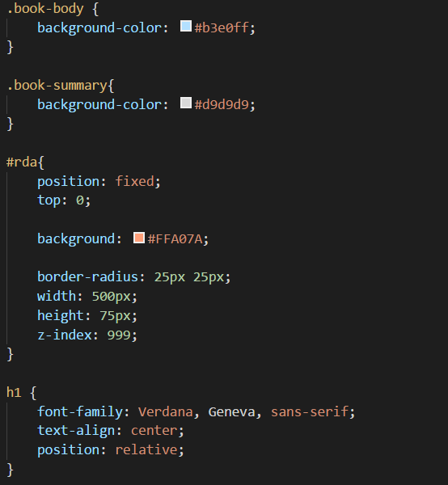

# How to add Style to your gitbook

### Although gitbook automatically generates your markdown files into html for website display, it is also highly customizable by adding your own html and css code

## 1. Add css to your book

- In your book.json configuration file, you can add a path to your css file like this:

```
    "styles": {
        "website": "styles/website.css"
    }
```

## Modify css

- There are few css classes that are specific to gitbook as you can see below, such as book-body and book-summary:

    

## You can have more control over the design of your book by adding html code to your markdown files

- For example, I added html to assign an id to an element so that I can add specific characteristics to it:

    

    > You can see what I added by refering to the css image attached above


